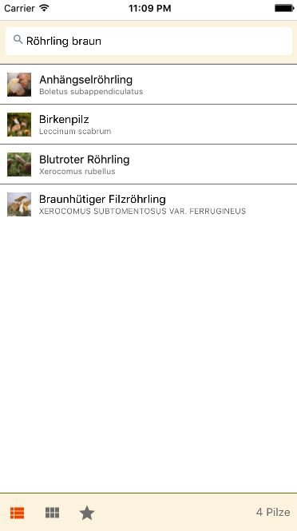
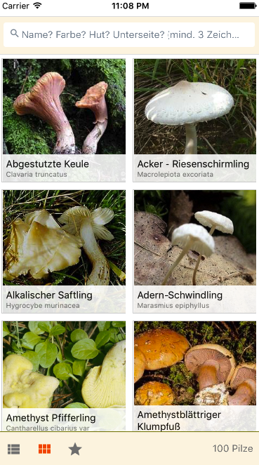

Kleines Beispielprojekt um React Native mit Redux auszuprobieren.

 

TODOs:
- [x] React App Komponenten Liste + Kopfzeile
- [x] Redux Integration
- [x] Beispieldaten einlesen in State der Liste (JSON-Datensatz)
- [x] Suchbegriff als State halten
- [x] Suchbegriff zum Filtern der Liste nutzen
- [x] nach Tap auf Item Details + Bild zum Pilz (externe URL)
- [x] Details-Bild mit Progress-Bar
- [-] Images in Liste cachen (prefetch)
- [x] Bottom-Navi für Anzahl Treffer
- [x] Pilze faven
- [ ] Suchfilter: Farben, Arten, essbar/giftig
  - Overlay wie http://stackoverflow.com/questions/30638739/transparent-overlay-in-react-native
- [ ] Infos von Wiki in WebView
  - https://de.m.wikipedia.org/wiki/Speisepilz
  - https://de.m.wikipedia.org/wiki/Wikipedia:Hinweise_zum_Pilzesammeln
- [ ] Pilze von Wiki einlesen -> JSON
  - https://de.m.wikipedia.org/wiki/Kategorie:Speisepilzart

  - 