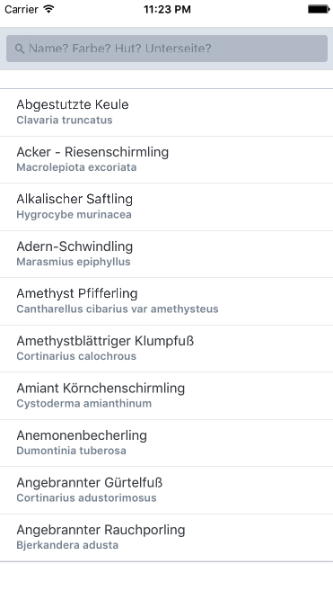

Kleines Beispielprojekt um React Native mit Redux auszuprobieren.

TODOs:
- [x] React App Komponenten Liste + Kopfzeile
- [x] Redux Integration
- [x] Beispieldaten einlesen in State der Liste (JSON-Datensatz)
- [x] Suchbegriff als State halten
- [x] Suchbegriff zum Filtern der Liste nutzen
- [x] nach Tap auf Item Details + Bild zum Pilz (externe URL)
- [x] Details-Bild mit Progress-Bar
- [ ] Images HTTP Cachen
- [ ] Bottom-Navi für Anzahl Treffer und "Neuer Eintrag"